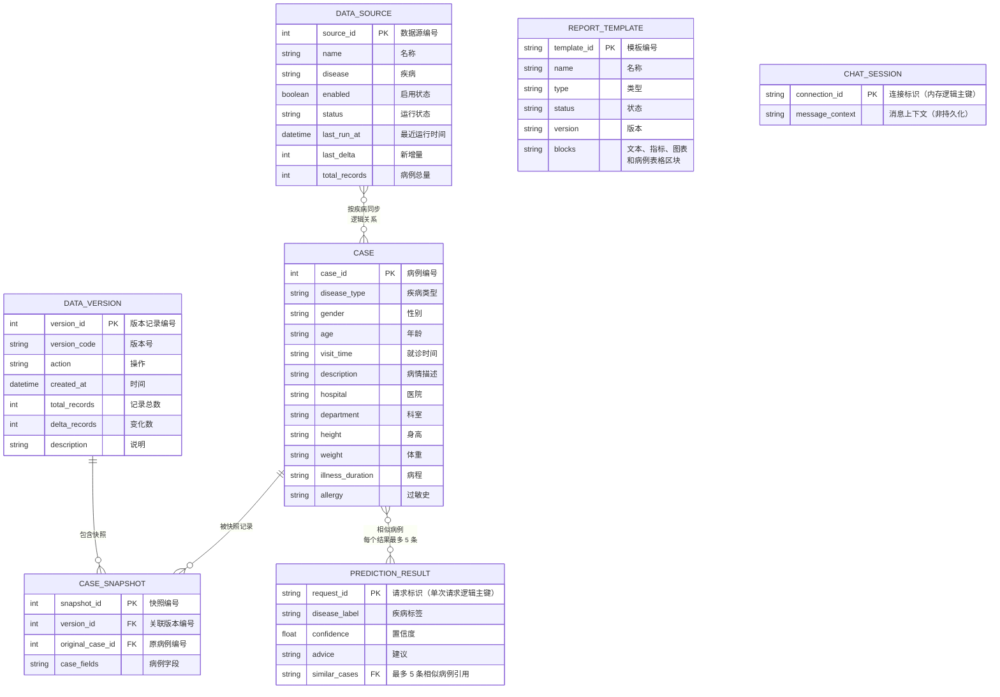

```mermaid
erDiagram
    CASE {
        int case_id PK "病例编号"
        string disease_type "疾病类型"
        string gender "性别"
        string age "年龄"
        string visit_time "就诊时间"
        string description "病情描述"
        string hospital "医院"
        string department "科室"
        string height "身高"
        string weight "体重"
        string illness_duration "病程"
        string allergy "过敏史"
    }

    DATA_SOURCE {
        int source_id PK "数据源编号"
        string name "名称"
        string disease "疾病"
        boolean enabled "启用状态"
        string status "运行状态"
        datetime last_run_at "最近运行时间"
        int last_delta "新增量"
        int total_records "病例总量"
    }

    DATA_VERSION {
        int version_id PK "版本记录编号"
        string version_code "版本号"
        string action "操作"
        datetime created_at "时间"
        int total_records "记录总数"
        int delta_records "变化数"
        string description "说明"
    }

    CASE_SNAPSHOT {
        int snapshot_id PK "快照编号"
        int version_id FK "关联版本编号"
        int original_case_id FK "原病例编号"
        string case_fields "病例字段"
    }

    REPORT_TEMPLATE {
        string template_id PK "模板编号"
        string name "名称"
        string type "类型"
        string status "状态"
        string version "版本"
        string blocks "文本、指标、图表<br>和病例表格区块"
    }

    CHAT_SESSION {
        string connection_id PK "连接标识（内存逻辑主键）"
        string message_context "消息上下文（非持久化）"
    }

    PREDICTION_RESULT {
        string request_id PK "请求标识（单次请求逻辑主键）"
        string disease_label "疾病标签"
        float confidence "置信度"
        string advice "建议"
        string similar_cases FK "最多 5 条相似病例引用"
    }

    DATA_VERSION ||--o{ CASE_SNAPSHOT : "包含快照"
    CASE ||--o{ CASE_SNAPSHOT : "被快照记录"
    CASE }o--o{ PREDICTION_RESULT : "相似病例<br>每个结果最多 5 条"
    DATA_SOURCE }o--o{ CASE : "按疾病同步<br>逻辑关系"

    %% CASE_SNAPSHOT 和 PREDICTION_RESULT 的外键为逻辑关联，当前数据库未声明物理外键约束。
    %% DATA_SOURCE 与 CASE 按疾病类型匹配；CHAT_SESSION 和 PREDICTION_RESULT 不持久化。
```
