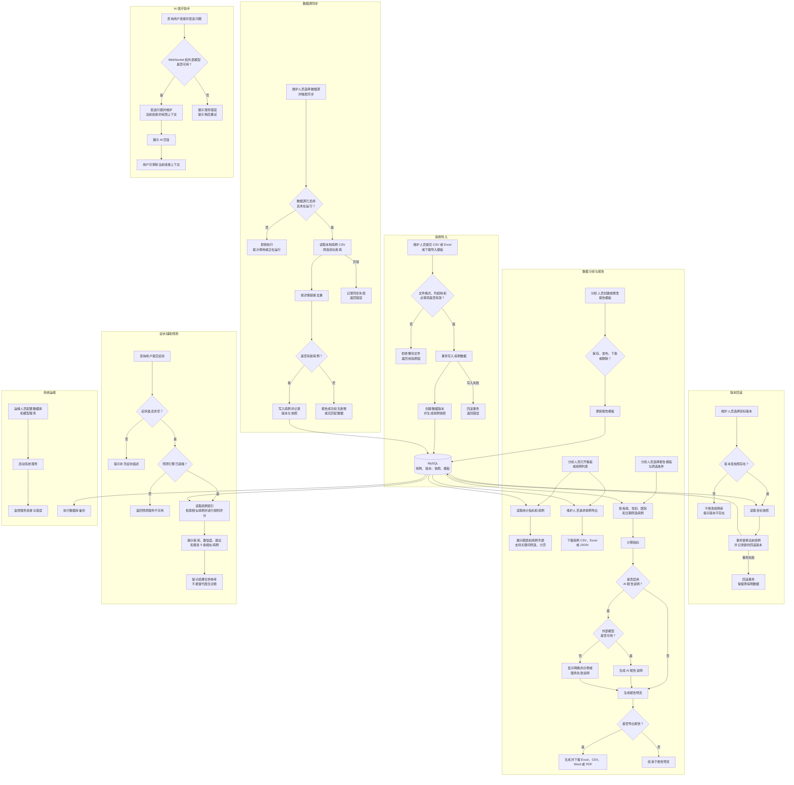

```mermaid
flowchart TD
    subgraph DATA_IMPORT["病例导入"]
        direction TD
        I1["维护人员提交 CSV 或 Excel<br>或下载导入模板"] --> I2{"文件格式、列结构和<br>必填项是否有效？"}
        I2 -- 否 --> I3["拒绝整份文件<br>返回校验原因"]
        I2 -- 是 --> I4["事务写入病例数据"]
        I4 --> I5["创建数据版本<br>并生成病例快照"]
        I5 --> DB[(MySQL<br>病例、版本、快照、模板)]
        I4 -- 写入失败 --> I6["回滚事务<br>返回错误"]
    end

    subgraph SOURCE_SYNC["数据源同步"]
        direction TD
        S1["维护人员选择数据源<br>并触发同步"] --> S2{"数据源已启用<br>且未在运行？"}
        S2 -- 否 --> S3["拒绝执行<br>提示停用或正在运行"]
        S2 -- 是 --> S4["读取本地病例 CSV<br>筛选目标疾病"]
        S4 --> S5["按详情链接去重"]
        S5 --> S6{"是否有新病例？"}
        S6 -- 是 --> S7["写入病例并记录<br>版本与快照"]
        S7 --> DB
        S6 -- 否 --> S8["报告成功但无新增<br>或无匹配数据"]
        S4 -- 异常 --> S9["记录同步失败<br>返回错误"]
    end

    subgraph VERSION_ROLLBACK["版本回滚"]
        direction TD
        V1["维护人员选择目标版本"] --> V2{"版本及快照存在？"}
        V2 -- 否 --> V3["不修改病例库<br>提示版本不存在"]
        V2 -- 是 --> V4["读取目标快照"]
        DB --> V4
        V4 --> V5["事务替换当前病例<br>并记录新的回滚版本"]
        V5 --> DB
        V5 -- 事务失败 --> V6["回滚事务<br>保留原病例数据"]
    end

    subgraph ANALYSIS_REPORT["数据分析与报告"]
        direction TD
        A1["分析人员打开看板<br>或病例列表"] --> A2["读取统计指标和病例"]
        DB --> A2
        A2 --> A3["展示图表和病例列表<br>支持关键词筛选、分页"]
        A1 --> A4["维护人员请求病例导出"]
        DB --> A4
        A4 --> A5["下载病例 CSV、Excel<br>或 JSON"]

        A6["分析人员选择报告模板<br>与筛选条件"] --> A7["按疾病、性别、医院<br>和日期筛选病例"]
        DB --> A7
        A7 --> A8["计算指标"]
        A8 --> A8A{"是否启用<br>AI 报告说明？"}
        A8A -- 否 --> A8D["生成报告预览"]
        A8A -- 是 --> A8B{"外部模型<br>是否可用？"}
        A8B -- 是 --> A8C["生成 AI 报告说明"]
        A8B -- 否 --> A8E["显示明确的示例或<br>服务失败说明"]
        A8C --> A8D
        A8E --> A8D
        A8D --> A9{"是否导出报告？"}
        A9 -- 是 --> A10["生成并下载 Excel、CSV、<br>Word 或 PDF"]
        A9 -- 否 --> A11["结束于报告预览"]

        A12["分析人员创建或修改<br>报告模板"] --> A13{"保存、发布、下架<br>或删除？"}
        A13 --> A14["更新报告模板"]
        A14 --> DB
    end

    subgraph PREDICTION["症状辅助预测"]
        direction TD
        P1["咨询用户提交症状"] --> P2{"症状描述非空？"}
        P2 -- 否 --> P3["提示补充症状描述"]
        P2 -- 是 --> P4{"预测引擎已就绪？"}
        P4 -- 否 --> P5["返回预测服务不可用"]
        P4 -- 是 --> P6["读取病例索引<br>检索相似病例并进行规则评分"]
        DB --> P6
        P6 --> P7["展示疾病、置信度、建议<br>和最多 5 条相似病例"]
        P7 --> P8["提示结果仅供参考<br>不能替代医生诊断"]
    end

    subgraph AI_CHAT["AI 医疗助手"]
        direction TD
        C1["咨询用户连接并发送问题"] --> C2{"WebSocket 和外部模型<br>是否可用？"}
        C2 -- 是 --> C3["发送问题并维护<br>当前连接的有限上下文"]
        C3 --> C4["展示 AI 回复"]
        C2 -- 否 --> C5["展示服务错误<br>提示稍后重试"]
        C4 --> C6["用户可清除当前连接上下文"]
    end

    subgraph OPERATIONS["系统运维"]
        direction TD
        O1["运维人员配置数据库<br>和模型服务"] --> O2["启动系统服务"]
        O2 --> O3["监控服务连接与错误"]
        DB --> O4["执行数据库备份"]
    end
```
