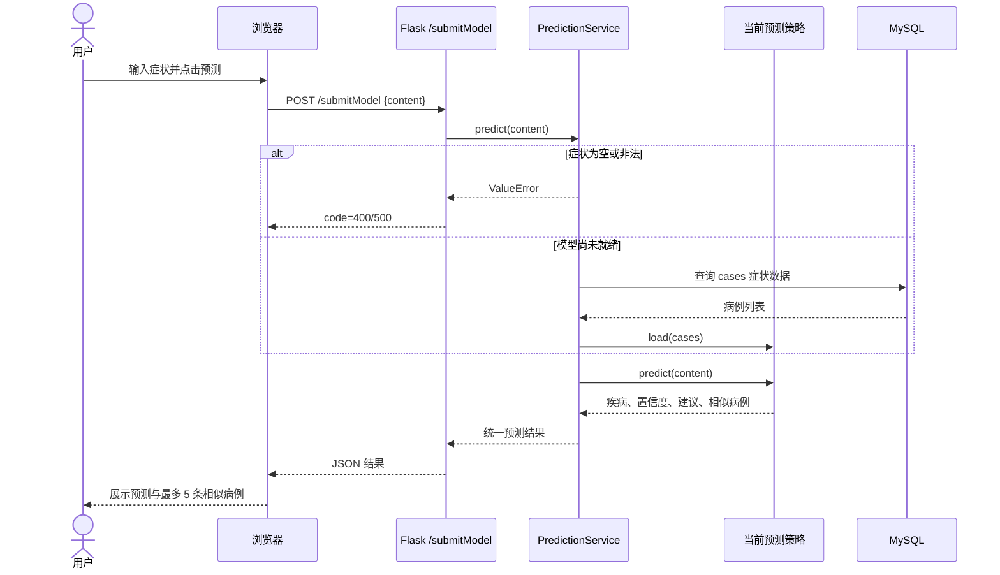
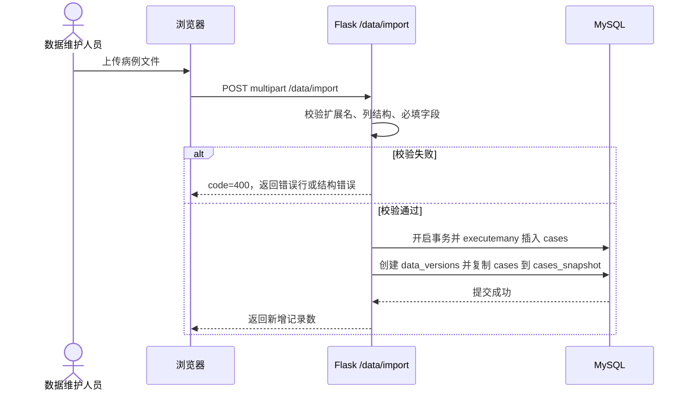
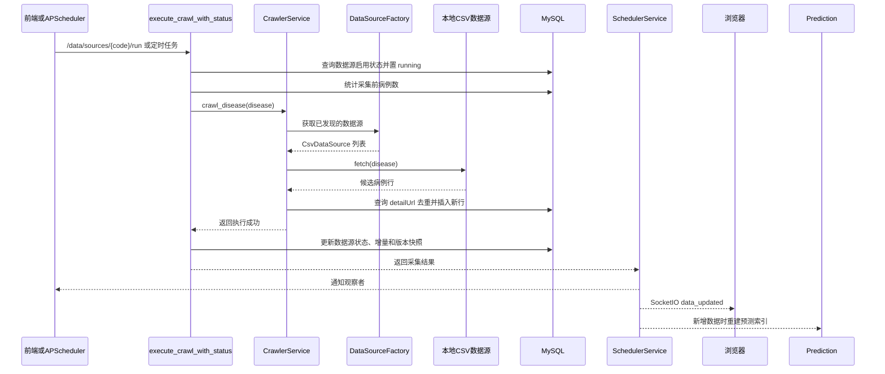
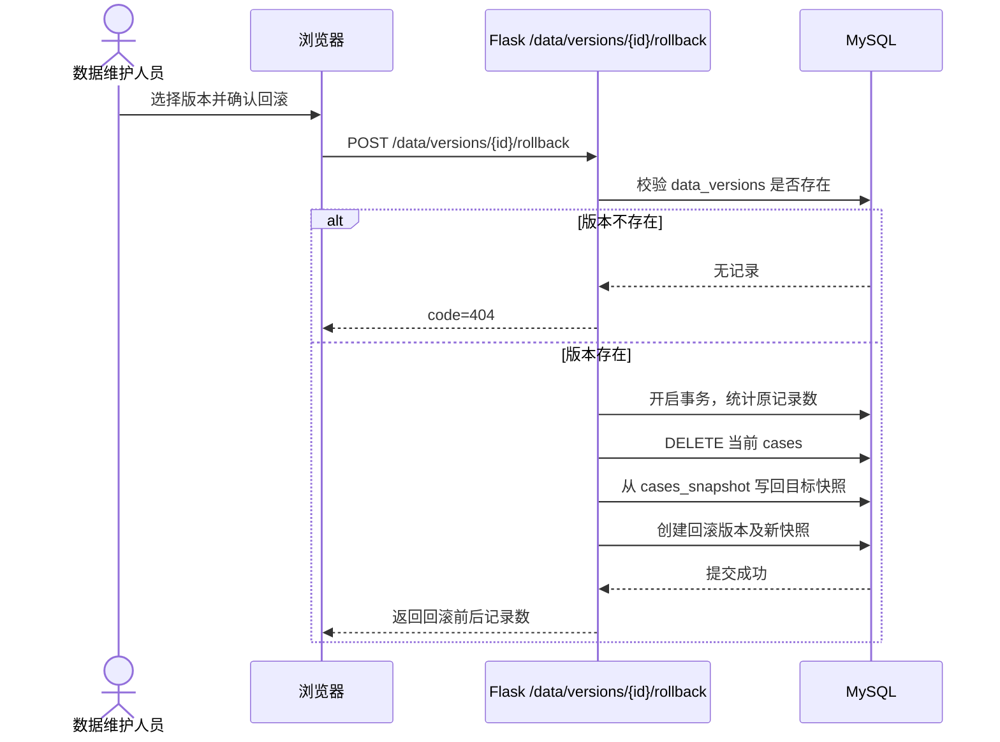
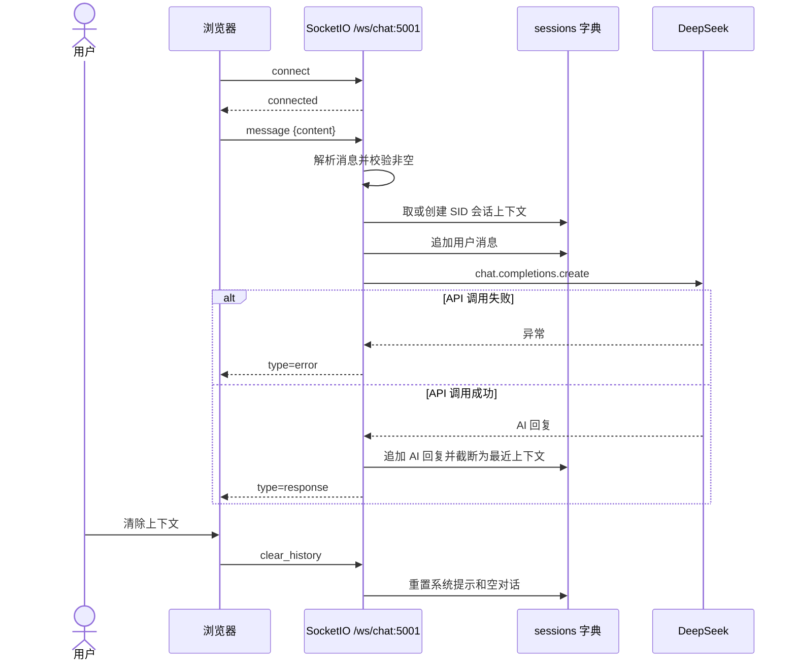
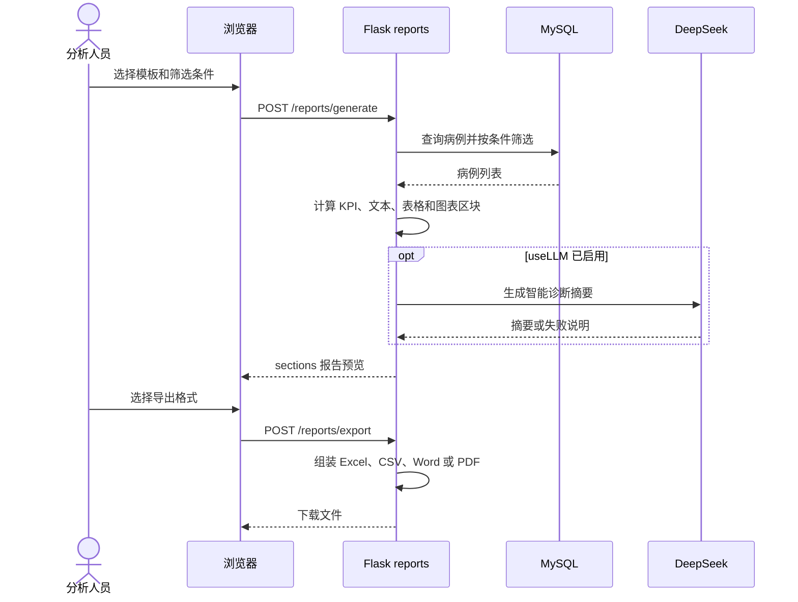

# 时序图

以下时序图覆盖当前实现中的主要交互。

## 疾病预测

```mermaid
sequenceDiagram
    actor 用户
    participant 浏览器
    participant Flask as Flask /submitModel
    participant Prediction as PredictionService
    participant 策略 as 当前预测策略
    participant MySQL

    用户->>浏览器: 输入症状并点击预测
    浏览器->>Flask: POST /submitModel {content}
    Flask->>Prediction: predict(content)
    alt 症状为空或非法
        Prediction-->>Flask: ValueError
        Flask-->>浏览器: code=400/500
    else 模型尚未就绪
        Prediction->>MySQL: 查询 cases 症状数据
        MySQL-->>Prediction: 病例列表
        Prediction->>策略: load(cases)
    end
    Prediction->>策略: predict(content)
    策略-->>Prediction: 疾病、置信度、建议、相似病例
    Prediction-->>Flask: 统一预测结果
    Flask-->>浏览器: JSON 结果
    浏览器-->>用户: 展示预测与最多 5 条相似病例
```

## CSV / Excel 病例导入

```mermaid
sequenceDiagram
    actor 数据维护人员
    participant 浏览器
    participant Flask as Flask /data/import
    participant MySQL

    数据维护人员->>浏览器: 上传病例文件
    浏览器->>Flask: POST multipart /data/import
    Flask->>Flask: 校验扩展名、列结构、必填字段
    alt 校验失败
        Flask-->>浏览器: code=400，返回错误行或结构错误
    else 校验通过
        Flask->>MySQL: 开启事务并 executemany 插入 cases
        Flask->>MySQL: 创建 data_versions 并复制 cases 到 cases_snapshot
        MySQL-->>Flask: 提交成功
        Flask-->>浏览器: 返回新增记录数
    end
```

## 手动或定时采集

```mermaid
sequenceDiagram
    participant 触发器 as 前端或APScheduler
    participant Flask as execute_crawl_with_status
    participant Crawler as CrawlerService
    participant Factory as DataSourceFactory
    participant CSV as 本地CSV数据源
    participant MySQL
    participant Scheduler as SchedulerService

    触发器->>Flask: /data/sources/{code}/run 或定时任务
    Flask->>MySQL: 查询数据源启用状态并置 running
    Flask->>MySQL: 统计采集前病例数
    Flask->>Crawler: crawl_disease(disease)
    Crawler->>Factory: 获取已发现的数据源
    Factory-->>Crawler: CsvDataSource 列表
    Crawler->>CSV: fetch(disease)
    CSV-->>Crawler: 候选病例行
    Crawler->>MySQL: 查询 detailUrl 去重并插入新行
    Crawler-->>Flask: 返回执行成功
    Flask->>MySQL: 更新数据源状态、增量和版本快照
    Flask-->>Scheduler: 返回采集结果
    Scheduler-->>触发器: 通知观察者
    Scheduler-->>浏览器: SocketIO data_updated
    Scheduler-->>Prediction: 新增数据时重建预测索引
```

## 数据版本回滚

```mermaid
sequenceDiagram
    actor 数据维护人员
    participant 浏览器
    participant Flask as Flask /data/versions/{id}/rollback
    participant MySQL

    数据维护人员->>浏览器: 选择版本并确认回滚
    浏览器->>Flask: POST /data/versions/{id}/rollback
    Flask->>MySQL: 校验 data_versions 是否存在
    alt 版本不存在
        MySQL-->>Flask: 无记录
        Flask-->>浏览器: code=404
    else 版本存在
        Flask->>MySQL: 开启事务，统计原记录数
        Flask->>MySQL: DELETE 当前 cases
        Flask->>MySQL: 从 cases_snapshot 写回目标快照
        Flask->>MySQL: 创建回滚版本及新快照
        MySQL-->>Flask: 提交成功
        Flask-->>浏览器: 返回回滚前后记录数
    end
```

## AI 医疗助手聊天

```mermaid
sequenceDiagram
    actor 用户
    participant 浏览器
    participant Socket as SocketIO /ws/chat:5001
    participant 内存 as sessions 字典
    participant DeepSeek

    浏览器->>Socket: connect
    Socket-->>浏览器: connected
    浏览器->>Socket: message {content}
    Socket->>Socket: 解析消息并校验非空
    Socket->>内存: 取或创建 SID 会话上下文
    Socket->>内存: 追加用户消息
    Socket->>DeepSeek: chat.completions.create
    alt API 调用失败
        DeepSeek-->>Socket: 异常
        Socket-->>浏览器: type=error
    else API 调用成功
        DeepSeek-->>Socket: AI 回复
        Socket->>内存: 追加 AI 回复并截断为最近上下文
        Socket-->>浏览器: type=response
    end
    用户->>浏览器: 清除上下文
    浏览器->>Socket: clear_history
    Socket->>内存: 重置系统提示和空对话
```

## 报告生成与导出

```mermaid
sequenceDiagram
    actor 分析人员
    participant 浏览器
    participant Flask as Flask reports
    participant MySQL
    participant DeepSeek

    分析人员->>浏览器: 选择模板和筛选条件
    浏览器->>Flask: POST /reports/generate
    Flask->>MySQL: 查询病例并按条件筛选
    MySQL-->>Flask: 病例列表
    Flask->>Flask: 计算 KPI、文本、表格和图表区块
    opt useLLM 已启用
        Flask->>DeepSeek: 生成智能诊断摘要
        DeepSeek-->>Flask: 摘要或失败说明
    end
    Flask-->>浏览器: sections 报告预览
    分析人员->>浏览器: 选择导出格式
    浏览器->>Flask: POST /reports/export
    Flask->>Flask: 组装 Excel、CSV、Word 或 PDF
    Flask-->>浏览器: 下载文件
```
