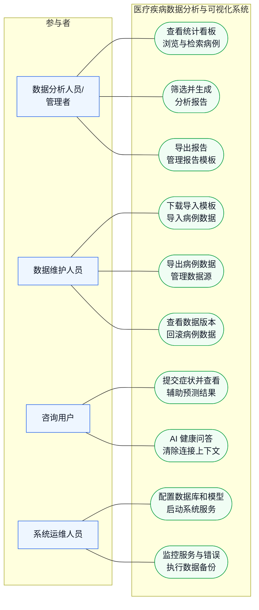

```mermaid
flowchart LR
    subgraph ACTORS["参与者"]
        direction TB
        A1["数据分析人员/<br>管理者"]
        A2["数据维护人员"]
        A3["咨询用户"]
        A4["系统运维人员"]
    end

    subgraph SYSTEM["医疗疾病数据分析与可视化系统"]
        direction TB
        U1(["查看统计看板<br>浏览与检索病例"])
        U2(["筛选并生成<br>分析报告"])
        U3(["导出报告<br>管理报告模板"])
        U4(["下载导入模板<br>导入病例数据"])
        U5(["导出病例数据<br>管理数据源"])
        U6(["查看数据版本<br>回滚病例数据"])
        U7(["提交症状并查看<br>辅助预测结果"])
        U8(["AI 健康问答<br>清除连接上下文"])
        U9(["配置数据库和模型<br>启动系统服务"])
        U10(["监控服务与错误<br>执行数据备份"])
    end

    A1 --- U1
    A1 --- U2
    A1 --- U3

    A2 --- U4
    A2 --- U5
    A2 --- U6

    A3 --- U7
    A3 --- U8

    A4 --- U9
    A4 --- U10

    classDef actor fill:#eef6ff,stroke:#2563eb,color:#111827
    classDef usecase fill:#f0fdf4,stroke:#16a34a,color:#111827
    class A1,A2,A3,A4 actor
    class U1,U2,U3,U4,U5,U6,U7,U8,U9,U10 usecase
```
