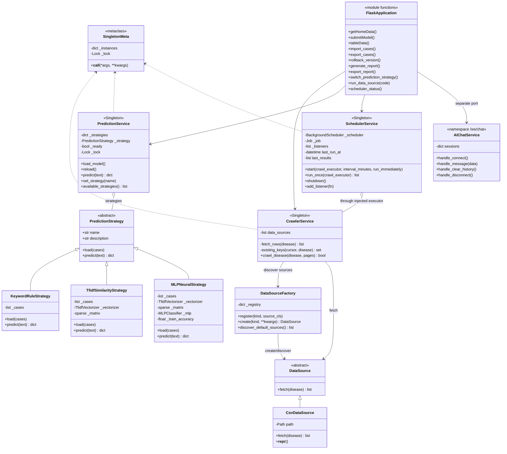

# 类图

下图描述后端核心类、数据源抽象、预测策略及 Flask 编排入口。

```mermaid
classDiagram
    class SingletonMeta {
        <<metaclass>>
        -dict _instances
        -Lock _lock
        +__call__(*args, **kwargs)
    }

    class DataSource {
        <<abstract>>
        +fetch(disease) list
    }

    class CsvDataSource {
        -Path path
        +fetch(disease) list
        +__repr__()
    }

    class DataSourceFactory {
        -dict _registry
        +register(kind, source_cls)
        +create(kind, **kwargs) DataSource
        +discover_default_sources() list
    }

    class CrawlerService {
        <<Singleton>>
        -list data_sources
        -fetch_rows(disease) list
        -existing_keys(cursor, disease) set
        +crawl_disease(disease, pages) bool
    }

    class PredictionStrategy {
        <<abstract>>
        +str name
        +str description
        +load(cases)
        +predict(text) dict
    }

    class KeywordRuleStrategy {
        -list _cases
        +load(cases)
        +predict(text) dict
    }

    class TfidfSimilarityStrategy {
        -list _cases
        -TfidfVectorizer _vectorizer
        -sparse _matrix
        +load(cases)
        +predict(text) dict
    }

    class MLPNeuralStrategy {
        -list _cases
        -TfidfVectorizer _vectorizer
        -sparse _matrix
        -MLPClassifier _mlp
        -float _train_accuracy
        +load(cases)
        +predict(text) dict
    }

    class PredictionService {
        <<Singleton>>
        -dict _strategies
        -PredictionStrategy _strategy
        -bool _ready
        -Lock _lock
        +load_model()
        +reload()
        +predict(text) dict
        +set_strategy(name)
        +available_strategies() list
    }

    class SchedulerService {
        <<Singleton>>
        -BackgroundScheduler _scheduler
        -Job _job
        -list _listeners
        -datetime last_run_at
        -list last_results
        +start(crawl_executor, interval_minutes, run_immediately)
        +run_once(crawl_executor) list
        +shutdown()
        +add_listener(fn)
    }

    class FlaskApplication {
        <<module functions>>
        +getHomeData()
        +submitModel()
        +tableData()
        +import_cases()
        +export_cases()
        +rollback_version()
        +generate_report()
        +export_report()
        +switch_prediction_strategy()
        +run_data_source(code)
        +scheduler_status()
    }

    class AIChatService {
        <<namespace /ws/chat>>
        -dict sessions
        +handle_connect()
        +handle_message(data)
        +handle_clear_history()
        +handle_disconnect()
    }

    DataSource <|-- CsvDataSource
    DataSourceFactory --> DataSource : create/discover
    CrawlerService --> DataSourceFactory : discover sources
    CrawlerService --> DataSource : fetch
    SingletonMeta <.. CrawlerService
    SingletonMeta <.. PredictionService
    SingletonMeta <.. SchedulerService
    PredictionStrategy <|-- KeywordRuleStrategy
    PredictionStrategy <|-- TfidfSimilarityStrategy
    PredictionStrategy <|-- MLPNeuralStrategy
    PredictionService o-- PredictionStrategy : strategies
    SchedulerService o-- CrawlerService : through injected executor
    FlaskApplication --> CrawlerService
    FlaskApplication --> PredictionService
    FlaskApplication --> SchedulerService
    FlaskApplication --> AIChatService : separate port
```
